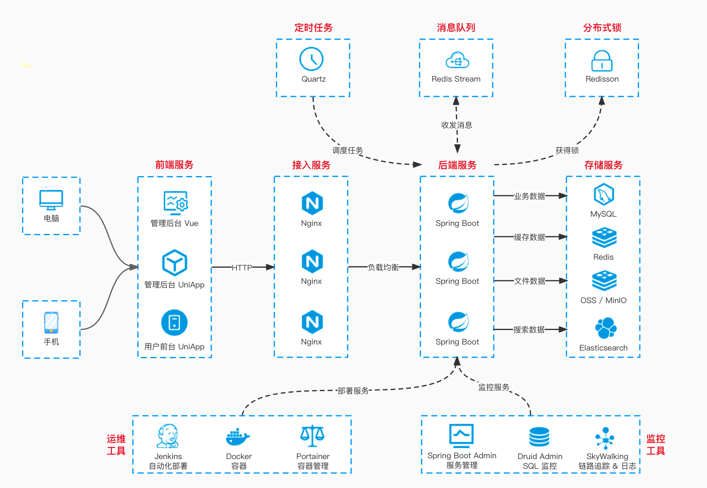

# I. What is KuggaDuke

## 1. Introduction

KuggaDuke, a decentralized social platform built on the WEB3.0 concept, emphasizes enabling users to independently create and join guild organizations that represent their interests or skills. Within KuggaDuke, each guild operates as an autonomous community, with members setting their administrative rules and standards based on their interests.

Users in KuggaDuke can utilize their strengths, joining various guilds to fulfill their self-worth. Guilds internally ensure equal distribution of resources and profits, with users gaining benefits through in-guild interactions and contributions. Furthermore, guilds can unlock more advanced features through authentication.

Contrasting traditional centralized social platforms, KuggaDuke prioritizes fairness and user sovereignty. By participating in KuggaDuke's guild organizations, users enjoy an open, transparent social environment, equitable self-governing organizational structures, and substantial interactive earnings.

## 2. Design Philosophy and Advantages

KuggaDuke's design philosophy congregates users of similar interests and abilities, offering a platform for free exchange. Embracing the WEB3.0 concept, KuggaDuke employs a decentralized social model, advocating for significant autonomy and self-management within guilds. Here, users can unrestrictedly join or establish guilds reflecting their interests, with members crafting collaborative norms and equally engaging in guild activities. The platform furnishes fundamental support without interfering with guild internals.

This decentralized operational approach grants guilds and users greater autonomy. Guilds can tailor governance rules and standards, ensuring fair and logical resource distribution. Users freely engage with guilds of interest, while the interest-based communities naturally foster high-quality user engagement. Content generated within guilds aligns closely with member interests, enhancing platform vibrancy. Guild members are thus more inclined to contribute within their interest realms.

## 3. Application Scope

KuggaDuke, anchored on interests, hobbies, and skills, centralizes its application scope around connecting like-minded users, fostering deep exchanges and value realization within shared interest and skill sectors.

KuggaDuke's extensive applications include:

- Interest Communities - Users form exclusive groups based on hobbies, carving out personal communication spaces.
- Personal Socializing - Users construct personal hubs, broadcasting updates, and recommendations to present themselves.
- Community Commerce - Users gain substantial rewards and recognition through guild interactions.
- Decentralized Autonomy - Guilds achieve significant self-governance and management.
- WEB3.0 Socializing - The platform advocates for open, transparent user management and value transmission.

Through endorsing interest communities, promoting personal socializing, initiating community commerce, establishing decentralized autonomy, and actualizing WEB3.0 socializing, KuggaDuke dedicates itself to building a fair, efficient social value network.

# II. What Capabilities Are Available

- The frontend adopts [vue-element-admin](https://github.com/PanJiaChen/vue-element-admin), now supporting Vue 3 + ElementUI Plus.
- The backend utilizes Spring Boot, MySQL + MyBatis Plus, Redis + Redisson.
- Databases compatible include MySQL, Oracle, PostgreSQL, SQL Server, MariaDB, domestic DM, TiDB, etc.
- Authentication incorporates Spring Security & Token & Redis, accommodating various terminals and user types.
- Supports dynamic permission menu loading, button-level permission control, and local caching for performance enhancement.
- Efficient development with a code generator for one-click generation of frontend and backend code, unit tests, Swagger API documentation, Validator parameter validation.
- Integration with various SMS channels (Alibaba Cloud, Tencent Cloud, Yuntong) and cloud storage services (MinIO, Alibaba Cloud, Tencent Cloud, Qiniu Cloud).

### System Features

| Feature      | Description                                                  |
| ------------ | ------------------------------------------------------------ |
| User Management | Configuring system users, the primary operators of the system |
| Role Management | Role-menu permission allocation, data range permission delineation by organization |
| Menu Management | System menu configuration, operation permissions, button permission identifiers, etc., enhanced by local caching |
| Dictionary Management | Maintenance of relatively stable, frequently used system data |
| Operation Log | System operation log recording and querying, with Swagger integration for log content generation |
| Login Log    | System login log recording and querying, including anomaly logs |
| Error Code Management | Comprehensive system error code management, allowing online error message modification without service restart |

### Basic Infrastructure

| Feature    | Description                                                  |
| ---------- | ------------------------------------------------------------ |
| Code Generation | Frontend and backend code generation (Java, Vue, SQL, unit tests), supporting CRUD download |
| System Interface | Auto-generation of RESTful API documentation via Swagger    |
| Database Documentation | Database documentation auto-generation via Screw, supporting Word, HTML, MD export formats |
| Configuration Management | Dynamic system configuration of common parameters, compatible with SpringBoot loading |
| Timed Tasks | Online task scheduling (addition, modification, deletion) including execution result logs |
| File Service | File storage support for S3 (MinIO, Alibaba Cloud, Tencent Cloud, Qiniu Cloud), local, FTP, database, etc. |
| API Logs    | RESTful API access and exception logs for troubleshooting   |
| MySQL Monitoring | Current system database connection pool status monitoring, SQL analysis for performance bottleneck identification |
| Redis Monitoring | Redis usage monitoring and Redis Key management             |
| Message Queue | Redis-based message queue, with Stream for cluster consumption and Pub/Sub for broadcast consumption |
| Java Monitoring | Java application monitoring via Spring Boot Admin           |
| Link Tracing | SkyWalking integration for link tracing                      |
| Log Center  | SkyWalking integration for centralized logging               |
| Distributed Lock | Redis-based

 distributed lock for concurrent scenarios       |
| Idempotency Component | Redis-based idempotency component to resolve repeat request issues |
| Service Guarantee | Service stability via Resilience4j, including rate limiting, circuit breaking, etc. |
| Log Service | Lightweight centralized logging for remote server log access |
| Unit Testing | JUnit + Mockito for unit testing, ensuring functionality correctness and code quality |

# III. System Architecture

## 1. Technical Architecture Diagram

## 2. Technology Stack

| Project               | Description                |
| --------------------- | -------------------------- |
| `kugga-dependencies`  | Maven dependency version management |
| `kugga-framework`     | Java framework extension   |
| `kugga-server`        | Backend + User APP server-side |
| `kugga-admin-ui`      | Backend UI interface       |
| `kugga-user-ui`       | User APP UI interface      |
| `kugga-module-system` | System module              |
| `kugga-module-member` | Membership center module   |
| `kugga-module-infra`  | Infrastructure module      |
| `kugga-module-tool`   | Development tools module   |
| `kugga-module-bpm`    | Workflow module            |
| `kugga-module-pay`    | Payment system module      |

### Backend

| Framework                                                   | Description           | Version | Learning Guide                                             |
| ----------------------------------------------------------- | ---------------------- | ------- | ---------------------------------------------------------- |
| [Spring Boot](https://spring.io/projects/spring-boot)       | Application development framework | 2.6.8   | [Documentation](https://github.com/YunaiV/SpringBoot-Labs) |
| [MySQL](https://www.mysql.com/cn/)                          | Database server        | 5.7     |                                                            |
| [Druid](https://github.com/alibaba/druid)                   | JDBC connection pool, monitoring component | 1.2.8   | [Documentation](http://www.iocoder.cn/Spring-Boot/datasource-pool/?kugga) |
| [MyBatis Plus](https://mp.baomidou.com/)                    | MyBatis enhancement tool package | 3.5.2   | [Documentation](http://www.iocoder.cn/Spring-Boot/MyBatis/?kugga) |
| [Dynamic Datasource](https://dynamic-datasource.com/)       | Dynamic data source    | 3.5.0   | [Documentation](http://www.iocoder.cn/Spring-Boot/datasource-pool/?kugga) |
| [Redis](https://redis.io/)                                  | key-value database     | 5.0     |                                                            |
| [Redisson](https://github.com/redisson/redisson)            | Redis client           | 3.17.3  | [Documentation](http://www.iocoder.cn/Spring-Boot/Redis/?kugga) |
| [Spring MVC](https://github.com/spring-projects/spring-framework/tree/master/spring-webmvc) | MVC framework          | 5.3.20  | [Documentation](http://www.iocoder.cn/SpringMVC/MVC/?kugga) |
| [Spring Security](https://github.com/spring-projects/spring-security) | Spring security framework | 5.6.5   | [Documentation](http://www.iocoder.cn/Spring-Boot/Spring-Security/?kugga) |
| [Hibernate Validator](https://github.com/hibernate/hibernate-validator) | Parameter validation component | 6.2.3   | [Documentation](http://www.iocoder.cn/Spring-Boot/Validation/?kugga) |
| [Activiti](https://github.com/Activiti/Activiti)            | Workflow engine        | 7.1.0.M6 | [Documentation](TODO)                                      |
| [Quartz](https://github.com/quartz-scheduler)               | Task scheduling component | 2.3.2   | [Documentation](http://www.iocoder.cn/Spring-Boot/Job/?kugga) |
| [Knife4j](https://gitee.com/xiaoym/knife4j)                 | Swagger enhanced UI implementation | 3.0.3   | [Documentation](http://www.iocoder.cn/Spring-Boot/Swagger/?kugga) |
| [Resilience4j](https://github.com/resilience4j/resilience4j) | Service guarantee component | 1.7.1   | [Documentation](http://www.iocoder.cn/Spring-Boot/Resilience4j/?kugga) |
| [SkyWalking](https://skywalking.apache.org/)                | Distributed application tracking system | 8.5.0   | [Documentation](http://www.iocoder.cn/Spring-Boot/SkyWalking/?kugga) |
| [Spring Boot Admin](https://github.com/codecentric/spring-boot-admin) | Spring Boot monitoring platform | 2.6.7   | [Documentation](http://www.iocoder.cn/Spring-Boot/Admin/?kugga) |
| [Jackson](https://github.com/FasterXML/jackson)             | JSON utility library   | 2.13.3  |                                                            |
| [MapStruct](https://mapstruct.org/)                         | Java Bean conversion   | 1.4.1   | [Documentation](http://www.iocoder.cn/Spring-Boot/MapStruct/?kugga) |
| [Lombok](https://projectlombok.org/)                        | Eliminates verbose Java code | 1.16.14 | [Documentation](http://www.iocoder.cn/Spring-Boot/Lombok/?kugga) |
| [JUnit](https://junit.org/junit5/)                          | Java unit testing framework | 5.8.2   | -                                                          |
| [Mockito](https://github.com/mockito/mockito)               | Java Mock framework    | 4.0.0   | -                                                          |

### Frontend

| Framework                                                   | Description        | Version |
| ----------------------------------------------------------- | ------------------- | ------- |
| [Vue](https://cn.vuejs.org/index.html)                      | JavaScript framework | 2.6.12 |
| [Vue Element Admin](https://panjiachen.github.io/vue-element-admin-site/zh/) | Backend frontend solution | -     |

# IV. Contact Us

## hisun_aiteam@outlook.com
